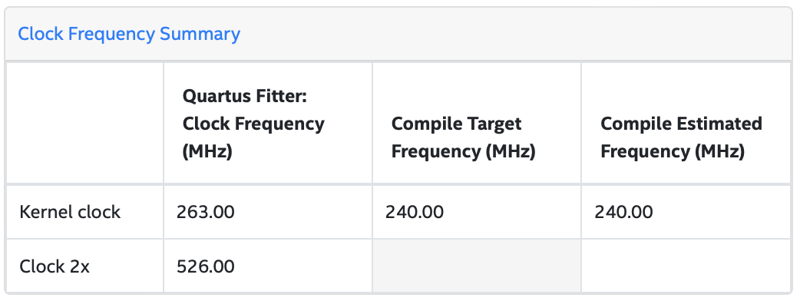

# blake3-fpga
BLAKE3 on FPGA

## Design

Imagine input byte array of 2048 -bytes to be hashed using BLAKE3, meaning input has 2 chunks, because BLAKE3 chunk size is 1KB. Each chunk has 16 message blocks, each of length 64 -bytes ( read 16 message words, because BLAKE3 word size is 32 -bit ). 16 message blocks of each chunk are required to be compressed 16 times sequentially --- output chaining value of i-th message block compression is used as input chaining value of (i + 1)-th message block, while first message block's input chaining value is constant initial hash values and 0 <= i <= 14. Due to this data dependency, in following FPGA design of BLAKE3, I compress j-th message block of i-th chunk, then j-th message block of (i + 1)-th chunk and it continues until we reach last chunk's j-th message block. All these N -many output chaining values of j-th message block compression are written to global memory. Now in next iteration it's time to compress (j + 1)-th message block for each of N -many chunks, while using j-th message block compression's output chaining values as input chaining value for respective chunk. This way all 16 message blocks are compressed for each of N -many chunks and those N -many output chaining values are considered leaf nodes of Binary Merkle Tree. Now computing BLAKE3 digest is simply finding root of Merkle Tree, while all intermediate nodes are computed by BLAKE3 `compress( ... )` function.


In above design diagram, you may want to following color coding to find out how 16 message blocks of each chunks are scheduled for compression in *chunk compression* phase.

> You may want to see BLAKE3 targeting multi-core CPU/ GPGPU, written using SYCL/ DPC++; see [here](https://github.com/itzmeanjan/blake3)

## Prerequisite

I'm on

```bash
lsb_release -d

Description:    Ubuntu 20.04.3 LTS
```

while using `dpcpp` as SYCL compiler

```bash
dpcpp --version

Intel(R) oneAPI DPC++/C++ Compiler 2022.0.0 (2022.0.0.20211123)
Target: x86_64-unknown-linux-gnu
Thread model: posix
InstalledDir: /opt/intel/oneapi/compiler/2022.0.2/linux/bin-llvm
```

You'd probably like to get Intel oneAPI basekit, which has everything required for FPGA development. See [here](https://www.intel.com/content/www/us/en/developer/tools/oneapi/base-toolkit.html).

Use `sycl-ls` utility to see if you can emulate FPGA design to check for functional correctness.

```bash
sycl-ls

[opencl:0] ACC : Intel(R) FPGA Emulation Platform for OpenCL(TM) 1.2 [2021.13.11.0.23_160000]
[opencl:0] CPU : Intel(R) OpenCL 3.0 [2021.13.11.0.23_160000]
[host:0] HOST: SYCL host platform 1.2 [1.2]
```

For running FPGA h/w synthesis and execution, you need to use Intel Devcloud.

## Usage

You can check functional correctness of BLAKE3 implementation on CPU by emulation.

```bash
make
```

You probably would like to see optimization report, which can be generated on non-FPGA attached host.

```bash
make fpga_opt_test
```

*You also have the option of running benchmark on CPU emulation, but you probably don't want to use those numbers as actual benchmark.*

```bash
make fpga_emu_bench # don't use as actual benchmark !
```

For running FPGA h/w test/ benchmark you'll need to go through **long** h/w synthesis phase, which can be executed on Intel Devcloud platform. See [here](https://devcloud.intel.com/oneapi/get_started/opencl).

### Job Submission

For easing FPGA h/w compilation/ execution job submissions on Intel Devcloud platform, I've use following scripts.

Assuming you're in root of this project

```bash
git clone https://github.com/itzmeanjan/blake3-fpga.git
cd blake3-fpga
```

#### Compilation Flow

Create job submission bash script

```bash
touch build_fpga_bench_hw.sh
```

And populate it with following content

```bash
#!/bin/bash

# file name: build_fpga_hw.sh

# env setup
export PATH=/glob/intel-python/python2/bin/:${PATH}
source /opt/intel/inteloneapi/setvars.sh > /dev/null 2>&1

# hardware compilation
#
# or use `fpga_hw_test`
time make fpga_hw_bench
```

Now submit compilation job targeting Intel Arria 10 board, while noting down job id

```bash
qsub -l nodes=1:fpga_compile:ppn=2 -l walltime=24:00:00 -d . build_fpga_bench_hw.sh

# note down job id e.g. 1850154
```

**Note :** If you happen to be interested in targeting Intel Stratix 10 board, consider using following compilation command instead of above Make build recipe.

```bash
# hardware compilation
time dpcpp -Wall -std=c++20 -I./include -O3 -DFPGA_HW -fintelfpga -Xshardware -Xsboard=intel_s10sx_pac:pac_s10 -reuse-exe=benchmark/fpga_hw.out benchmark/main.cpp -o benchmark/fpga_hw.out

# or consider reading Makefile
```

And finally submit job on `fpga_compile` enabled VM with same command shown as above.

#### Execution Flow

Create job submission shell script

```bash
touch run_fpga_bench_hw.sh
```

And populate it with environment setup and binary execution commands

```bash
#!/bin/bash

# file name: run_fpga_hw.sh

# env setup
export PATH=/glob/intel-python/python2/bin/:${PATH}
source /opt/intel/inteloneapi/setvars.sh > /dev/null 2>&1

# hardware image execution
#
# if testing using `fpga_hw_test` recipe,
# consider using `pushd test`
pushd benchmark; ./fpga_hw.out; popd
```

Now submit execution job on VM, enabled with `fpga_runtime` capability & Intel Arria 10 board, while creating job dependency chain, which will ensure as soon as **long** FPGA h/w synthesis is completed, h/w image execution will start running

```bash
qsub -l nodes=1:fpga_runtime:arria10:ppn=2 -d . run_fpga_bench_hw.sh -W depend=afterok:1850154

# use compilation flow job id ( e.g. 1850154 ) to create dependency chain
```

**Note :** If you compiled h/w image targeting Intel Stratix 10 board, consider using following job submission command

```bash
qsub -l nodes=1:fpga_runtime:stratix10:ppn=2 -d . run_fpga_bench_hw.sh -W depend=afterok:1850157

# place proper compilation job id ( e.g. 1850157 ), to form dependency chain
```

After completion of compilation/ execution job submission, consider checking status using

```bash
watch -n 1 qstat -n -1

# or just `qstat -n -1`
```

When completed, following command(s) should reveal newly created files, having stdout/ stderr output of compilation/ execution flow in `{build|run}_fpga_bench_hw.sh.{o|e}1850157` files

```bash
ls -lhrt   # created files shown towards end of list
git status # untracked, newly created files
```

> Note, I found [this](https://devcloud.intel.com/oneapi/documentation/job-submission) guide on job submission helpful.

## Benchmark

I've h/w synthesized BLAKE3 design targeting Intel Arria 10 board on Intel Devcloud platform.

```bash
running on pac_a10 : Intel PAC Platform (pac_ee00000)

Benchmarking BLAKE3 FPGA implementation

              input size		  execution time		host-to-device tx time		device-to-host tx time
                   1 MB		           1.127820 ms		         399.874625 us		          88.873000 us
                   2 MB		           2.205309 ms		         669.153625 us		          84.875875 us
                   4 MB		           4.353167 ms		           1.004857 ms		          85.069125 us
                   8 MB		           8.643984 ms		           1.633951 ms		          76.423375 us
                  16 MB		          17.219312 ms		           2.997660 ms		          79.418125 us
                  32 MB		          34.367224 ms		           6.250827 ms		          85.557125 us
                  64 MB		          68.657510 ms		          12.520800 ms		          85.347125 us
                 128 MB		         137.233338 ms		          23.457125 ms		          89.994000 us
                 256 MB		         274.380422 ms		          43.577968 ms		          87.475000 us
                 512 MB		         548.669188 ms		          84.584534 ms		          86.068250 us
                1024 MB		            1.097243 s		         167.424993 ms		          83.313750 us
```

Note, this design can benefit from replicating data path which compresses message blocks, but that comes with increased resource consumption. This (simple + straight-forward) baseline design, which interacts with global memory quite often, slows down due to high global memory access latecy. One future effort that can be put in improving this design is reducing interaction with global memory system and increasing usage of on-chip BRAM, while synthesizing more ( power of 2 -many ) replicas of BLAKE3 `compress( ... )` function, at cost of higher resource usage.

> I've also experimented with SYCL pipe based design pattern where producer-consumer pattern is utilized, reducing global memory access; but it turns out that due to hierarchical data dependency in BLAKE3 binary merkle tree, that pattern doesn't yield much useful results.

**👇 are taken from final report generated after FPGA h/w synthesis, targeting Intel Arria 10 board**

### Quartus Fitter Summary


### Design Clocking at



### Loop Pipelining/ II/ fMAX/ latency


### Resource Usage


